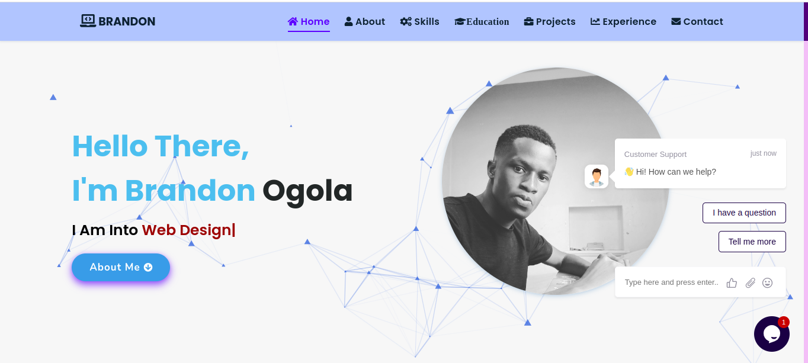

# Brandon Ogola - Personal Portfolio

Welcome to **Brandon Ogola's** personal portfolio website. Brandon is a passionate **Full-Stack Web Developer** and **Android App Developer** based in Nairobi, Kenya. This portfolio showcasesmy skills, projects, and professional background in web development, AI, and more.

[Visit My Portfolio](https://brandon-2i82.vercel.app/)

## Table of Contents
- [Introduction](#introduction)
- [Features](#features)
- [Technologies Used](#technologies-used)
- [Skills](#skills)
- [Projects](#projects)
- [Experience](#experience)
- [Education](#education)
- [Contact](#contact)

## Introduction
This portfolio website serves as a personal branding platform where I display my development skills, work experience, and academic achievements. It’s designed to provide an overview of my expertise in building full-stack web applications and AI-based systems.

## Features
- **Interactive Chatbot**: Newly incorporated chatbot to assist visitors, answer questions, and provide more information about my portfolio and skills.
- Clean, responsive design optimized for different screen sizes.
- Easy navigation through sections such as Home, About, Skills, Projects, Experience, and Contact.
- Integrated social media icons with links to LinkedIn, GitHub, Twitter, and Instagram profiles.
- Downloadable PDF resume for easy access to professional details.

## Technologies Used
- **HTML5**: For creating the structure of the website.
- **CSS3**: For styling and visual presentation.
- **JavaScript**: For adding interactivity and dynamic features.
- **Font Awesome**: For icons used throughout the website.
- **AWS**: For deployment and hosting services.
- **Python & TensorFlow**: Used in projects like AI chatbots and ML models.
  
## Skills
This section highlights my technical skills, along with progress bars representing proficiency in:
- **Python** (95%)
- **JavaScript** (90%)
- **React.js** (80%)
- **Node.js** (75%)
- **MongoDB** (90%)
- **AWS** (80%)
- **TensorFlow** (75%)
- **HTML5 & CSS3** (90%)
- **Git & GitHub** (85%)
- **Agile & Project Management Tools (Jira, Trello)** (80%)

## Projects
Some of the projects showcased on the website include:
- **AI-Powered Chatbot for Customer Support**: A chatbot designed using Natural Language Processing (NLP) and deployed with AWS Lambda.
- **E-commerce Website with Recommendation Engine**: A platform offering personalized product suggestions using collaborative and content-based filtering.
- **IoT Home Automation System**: A system to control home appliances remotely using IoT and AWS services.

## Experience
Brandon has over 3 years of experience in full-stack development. His expertise extends to freelancing, where he has contributed to various open-source projects and completed numerous client-based projects focusing on modern web development technologies.

## Education
- **Bachelor of Arts in Political Science and Literature** - University of Nairobi (Ongoing).
- **Software Engineering Bootcamp** - Moringa School (Completed).
- **Software Engineering Bootcamp** - Somakodi School (Ongoing)
  
## Contact
You can reach Brandon via email at **brandon14ogola@gmail.com** or through his social media profiles:
- [LinkedIn](https://www.linkedin.com/in/brandon-edwin-ogola-b77063232/)
- [GitHub](https://github.com/edogola4)
- [Twitter](https://twitter.com/BrandonOgola)
- [Instagram](https://www.instagram.com/ja._.tech/)

Feel free to explore the website, chat with the bot, and connect with me for any collaboration opportunities or queries.

